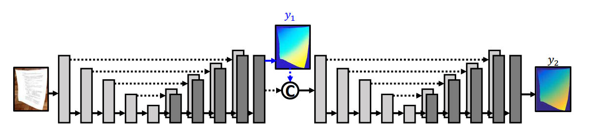
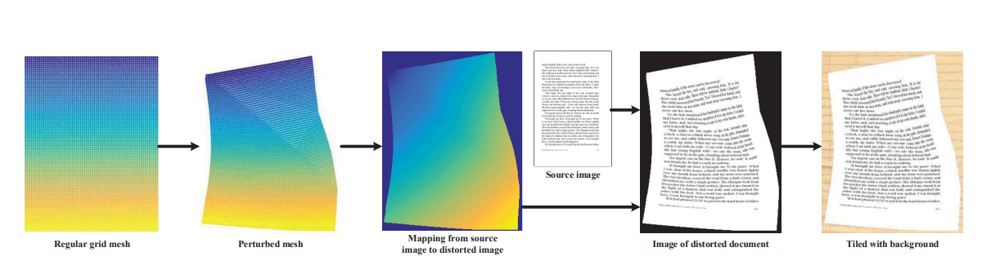
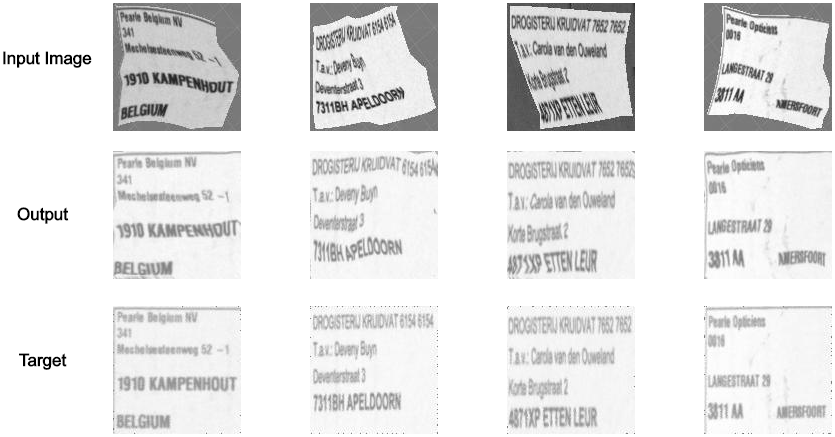

# Document Image unwarping

  

This repository contains an *unofficial* implementation of [DocUNet: Document Image Unwarping via a Stacked U-Net](http://openaccess.thecvf.com/content_cvpr_2018/html/Ma_DocUNet_Document_Image_CVPR_2018_paper.html). 
We extend this work by:
* predicting the inverted vector fields directly, which saves computation time during inference
* adding more networks that can be used: from UNet to Deeplabv3+ with different backbones
* adding a second loss function (MS-SSIM / SSIM) to measure the similarity between unwarped and target image
* achieving real-time inference speed (300ms) on cpu for Deeplabv3+ with MobileNetv2 as backbone

## Training dataset

Unfortunately, I am not allowed to make public the dataset. The idea is to create a 
2D vector field to deform a flat input image. The deformed image is used as network input and the vector field is the network target.

  

## Training on your dataset
1. Check the [available parser options](parser_options.py).
2. Set the path to your dataset in the [available parser options](parser_options.py).
3. Create the environment from the [conda file](environment.yml): `conda env create -f environment.yml`
4. Activate the conda environment: `conda activate unwarping_assignment`
5. Train the networks using the provided scripts: [1](main.py), [2](train.sh). The trained model is saved to the `save_dir` command line argument.
6. Run the [inference script](playground.py) on your set. The command line argument `inference_dir` should be used to provide the
relative path to the folder which contains the images to be classified.

## Sample results 

  

